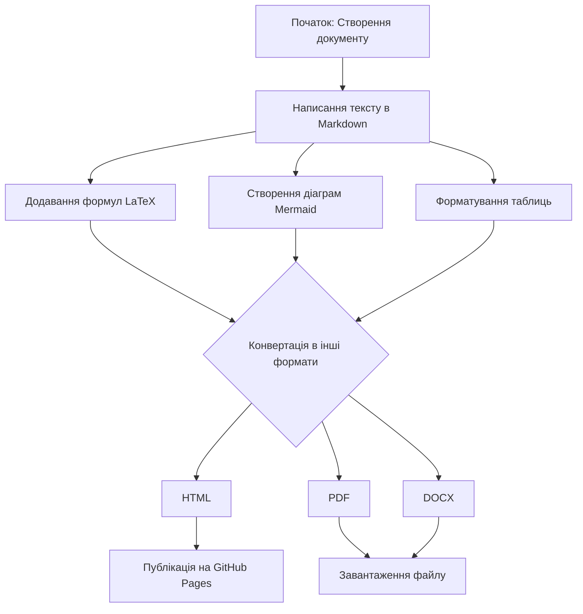

## Звіт з лабораторної роботи №3 

**на тему "Markdown"**

Виконала студентка групи ІКМ-223А

**Несміян Світлана Валеріївна**

## Короткий опис
Дана робота присвячена демонстрації функціональності мови розмітки Markdown для розробки структурованих документів. Вона забезпечує швидке форматування тексту, інтеграцію математичних виразів, створення таблиць та графічних елементів. Ключовою перевагою Markdown є його простота та можливість експорту в різноманітні формати, такі як HTML, PDF та DOCX. У рамках цього дослідження буде створено документ, що містить формули, списки, таблицю та діаграму, з подальшим розміщенням на платформі GitHub.

## Список улюблених книг

### Програмування та алгоритми
1. **"Алгоритми: побудова та аналіз"** - Томас Кормен
2. **"Чистий код"** - Роберт Мартін
3. **"Глибоке навчання"** - Іан Гудфеллоу

### Математика та наука
4. **"Математичний аналіз"** - Джеймс Стюарт
5. **"Фейнманові лекції з фізики"** - Річард Фейнман

## Математичні формули

### Інлайн-формули
Формула квадратного рівняння: $ax^2 + bx + c = 0$

Формула Ейлера: $e^{i\pi} + 1 = 0$

### Блочні формули

#### Теорема Піфагора
$$
a^2 + b^2 = c^2
$$

#### Формула Ейлера-Лагранжа
$$
\frac{d}{dt} \left( \frac{\partial L}{\partial \dot{q}} \right) = \frac{\partial L}{\partial q}
$$

#### Формула об'єму кулі
$$
V = \frac{4}{3} \pi r^3
$$

## Таблиця книг та кількості сторінок

| №  | Назва книги                   | Автор                      | Кількість сторінок |
|----|-------------------------------|----------------------------|--------------------|
| 1  | Майстер і Маргарита          | Михайло Булгаков           | 480                |
| 2  | Сто років самотності         | Габріель Гарсія Маркес     | 416                |
| 3  | 1984                         | Джордж Орвелл              | 328                |
| 4  | Брати Карамазови             | Федір Достоєвський         | 824                |
| 5  | Мистецтво програмування      | Дональд Кнут               | 672                |

---

## Діаграма процесу роботи з Markdown

## Висновки
У цій роботі ми розглянули практичне застосування Markdown для створення структурованих документів. Markdown дозволяє швидко та легко форматувати текст, включати математичні формули, будувати таблиці та діаграми. Головна перевага Markdown – простота та можливість конвертації в різні формати.